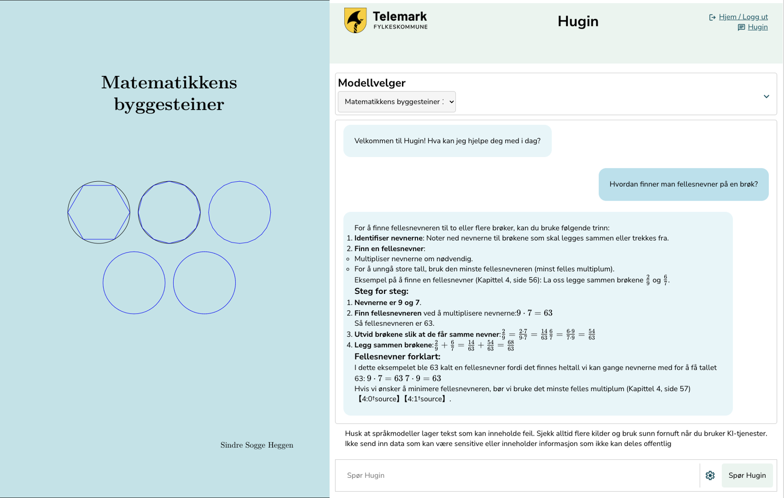
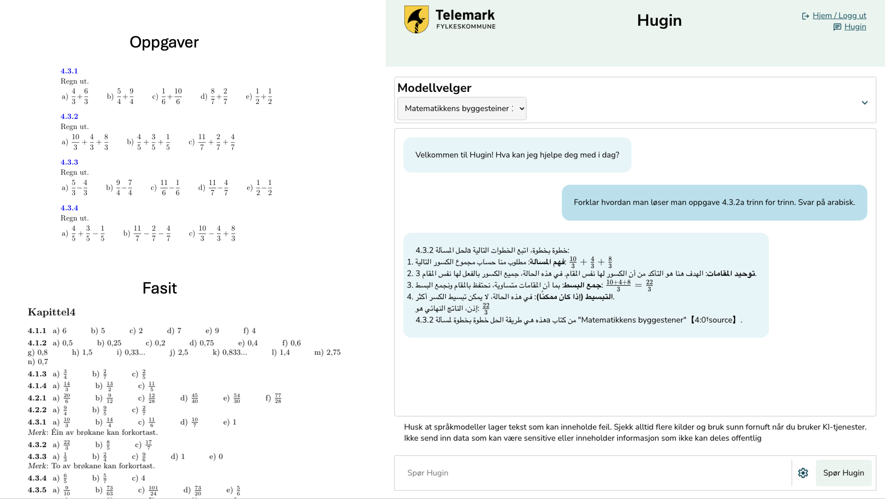

# ChatVTFK er død, leve Hugin og Munin!

**For omtrent for ett år siden ble ChatVTFK lansert som en av landets første KI-tjenester beregnet på elever og lærere i de vidergående skolene. Som vi alle vet så er den gamle fylkeskommunen historie, og med den, også tjenesten ChatVTFK.**

Det opprinnelige formålet med ChatVTFK var å tilby en KI-tjeneste som gjorde det mulig å bruke språkmodeller som pedagogisk verktøy i videregående opplæring, samt til planlegging og gjennomføring av undervisning. ChatVTFK skulle gjøre det mulig for lærere og elever å ta i bruk en fremvoksende teknologi på en ansvarlig måte. Tjenesten var tilgjengelig for alle elever og ansatte i gamle Vestfold og Telemark Fylkeskommune. Da Vestfold og Telemark Fylkeskommune ble delt var det fortsatt behov for en tjeneste som ChatVTFK. Utviklingen går raskt og det var nødvendig med noen justeringer. ChatVTFK har derfor blitt oppgradert med nye og kraftige funksjoner og videreført under navnene Hugin i Telemark, og Munin i Vestfold Fylkeskommune.

*To ravner - Bilde generert i Adobe Firefly*

"Hugin og Munin er i den norrøne mytologien Odins to ravner. De følger ham overalt, og vagler seg på Odins skuldre når han sitter i høysetet, Lidskjalv i Valhall. Derfor er et av Odins mange navn «Ravneguden». Hugin og Munin kommer av norrønt for ‘tanke’ og ‘minne, erindring’ Snorre skriver i Gylvaginning at Odin ved daggry sender Hugin og Munin ut i verden. De flyr over alle verdens kroker før de, tidlig om formiddagen, vender tilbake og setter seg på Odins skuldre. Der forteller de ham hva de har sett og hørt, slik at Odin får vite alt som skjer." (Kilde: [SNL - Hugin og Munin](https://snl.no/Hugin_og_Munin))

Med denne symbolikken ønsker vi å ta med oss ChatVTFK over i de to nye fylkene. Hugin i Telemark, og Munin i Vestfold. Ikke bare som to kopier av den gamle versjonen, men en ny og videreutviklet versjon med nytt design og ny funksjonalitet.

**Hugin gjør det mulig å ta i bruk en fremvoksende teknologi i hele organisasjonen på en ansvarlig måte.**

Hovedmålgruppen for Hugin og Munin er fortsatt elever og ansatte i Vestfold og Telemark fylkeskommuner, men tanken er også at Hugin skal muliggjøre utviklingsprosjekt der det overordnede formålet er å forbedre vår forståelse av mulighetene og implikasjonene ved bruk av KI-teknologi og KI-støttet praksis, i hele organisasjonen.

## Hvorfor bør fylkeskommunen lage sin egen KI-tjeneste?
Det er mange gode grunner til at vi bør ha en egen KI-tjeneste i fylkeskommunen. Det opprinnelige formålet med ChatVTFK, og nå Hugin, var å kunne tilby elever og lærere relevant teknologi på en ansvarlig måte. Med en ansvarlig KI-tjeneste menes at det er tatt hensyn til personvern, informasjonssikkerhet og etikk. I tillegg er det gjort flere designvalg for at tjenesten skal være så godt egnet som mulig til bruk i klasserommet. I tillegg er vi ikke prisgitt kommersielle aktører, som ofte ikke nødvendigvis har formål som er sammenfallende med organisasjonens. 

I september 2024 kom Riksrevisjonen med en [rapport](https://www.riksrevisjonen.no/rapporter-mappe/no-2023-2024/bruk-av-kunstig-intelligens-i-staten/) om bruk av kunstig intelligens i staten. Der kan vi lese at:

*Statlige virksomheter utnytter mulighetene med kunstig intelligens ulikt, og kunstig intelligens er fortsatt lite i bruk. Samlet sett er omfanget av utvikling og bruk av kunstig intelligens i staten så langt lite. Enkelte sektorer og virksomheter begynte imidlertid å utforske mulighetene for mer enn ti år siden, og noen har tatt mer avanserte systemer i bruk. Blant helseforetakene og for eksempel i Skatteetaten og Statens pensjonskasse finnes det eksempler på utvikling og bruk av kunstig intelligens som andre virksomheter kan lære av. Ettersom det totalt sett er få eksempler på at det har blitt utviklet og tatt i bruk KI-systemer, er det få eksempler hvor kunstig intelligens i stor grad har bidratt til effektivisering og en mer produktiv offentlig sektor. Etter Riksrevisjonens vurdering er det et stort, uutnyttet potensial i offentlig sektor til å effektivisere gjennom digitalisering og bruk av kunstig intelligens.* Kilde:[Riksrevisjonen](https://www.riksrevisjonen.no/rapporter-mappe/no-2023-2024/bruk-av-kunstig-intelligens-i-staten/)

Rapporten viser at det er et stort potensial for å effektivisere offentlig sektor gjennom digitalisering og bruk av kunstig intelligens. Dette er en av grunnene til at vi i fylkeskommunen ønsker å ha en egen KI-tjeneste. Vi ønsker å være i forkant av utviklingen og ta i bruk teknologi som kan gjøre oss mer effektive og gi bedre tjenester til innbyggerne. Samtidig ønsker vi å gjøre dette på en ansvarlig måte, der personvern, informasjonssikkerhet og etikk er ivaretatt.

Et av målene som ofte nevnes er at KI-teknologien skal være arbeidsbesparende og effektiviserende, men det viktig å ikke glemme at kvalitet også er en målsetting. Hvis denne teknologien kan øke kvaliteten på tjenestene vi leverer, så er det en stor gevinst som ikke alltid er så lett å måle i kroner og øre.

## Fra samtalerobot til læringsressurs
En av de viktigste endringene fra ChatVTFK til Hugin og Munin er at tjenesten har gått fra å være en ganske enkel samtalerobot til å være et mye kraftigere pedagogisk verktøy. Dette betyr at vi har lagt vekt på å utvikle funksjonalitet som gjør det mulig å bruke Hugin og Munin som en del av undervisningen. Eksempler på dette er at det nå er lagt inn mulighet til å "samtale med" lærebøker, selv lage kontekst og velge temperatur. Disse funksjonene er med på å synligjøre og vise fram for brukerne at KI ikke er en "sort boks", men et verktøy som brukerne kontrollerer og kan utnytte når det er hensiktsmessig.

Funksjonen der man kan samtale med lærebøker er et veldig interessant eksempel på hvordan KI-teknologi kan brukes i undervisningen. Her utnyttes språkmodellens store styrke; formuleringsevnen, til å forklare og gi eksempler som er hentet fra en kvalitetssikret kilde. På denne måten vil responsen fra Hugin være vesentlig mer pålitelig enn hvis man hadde brukt en generisk tjeneste som ChatGPT. I tillegg til at responsen er mer pålitelig vil den også oppgi kilde og gi brukeren mulighet til å gå videre og lese mer om emnet i læreboka.

*Bilde: Samtale i Hugin med læreboka "[Matematikkens byggesteiner](https://sindreheggen.wordpress.com/boker/)" skrevet av [Sindre Sogge Heggen](https://sindrsh.github.io/openmathbooks/) med lisens [CC BY-NC-SA 4.0](https://creativecommons.org/licenses/by-nc-sa/4.0/deed.no)*

Her kunne vi kanskje stoppet, men det er nå vi virkelig kan utnytte teknologien til noe interessant. Lærebøker har ofte oppgaver for at man skal kunne trene på temaet man jobber med. Til oppgavene finnes deg også en fasit.  Hva om vi kunne bruke Hugin til å forklare oppgavene og eksemplene i læreboka på en enkel og forståelig måte, og i tillegg på arabisk? 

*Bilde: Samtale med læreboka "Matematikkens byggesteiner" på arabisk*

Ved å bruke kraftig språkmodellteknologi sammen med kvalitetssikrede datakilder kan vi legge til rette for at lærere og elever i større grad får mulighet til å tilpasse undervisningen til den enkelte elevs behov. Dette kan være en stor fordel for elever som har behov for ekstra hjelp, eller som har et annet morsmål enn norsk. Denne teknologien vil også være sosialt utjevnende på den måten at den kan gi elever som har behov for ekstra hjelp mulighet til å få den hjelpen de trenger, uavhengig av forhold hjemme eller andre ytre faktorer.

## NoraLLM og andre språkmodeller
Fordelen med en egenutviklet KI-tjeneste som Hugin er at man i større grad kan tilpasse tjenesten til egne behov. Dette gjelder både funksjonalitet og innhold. En av de viktigste funksjonene i Hugin er at vi har tilgang til en norsk språkmodell, NoraLLM.

Nora er en familie med norske språkmodeller utviklet av språkteknologigruppen ved Universitet i Oslo (UiO), i samarbeid med blant annet Nasjonalbiblioteket, og er trent på norske tekster (bokmål og nynorsk). Til forskjell fra store språkmodelleer som GPT-4o, så er ikke Nora-modellen i Hugin en ferdigutviklet samtalerobot, som er laget for chat. Nora-modellen har som formål å vise hvordan en språkmodell som er trent på norske data kan skape tekst som bedre representerer norsk språk og kultur. I tillegg er mindre, åpne og spesialiserte modeller mer bærekraftige enn de virkelig store språkmodellene, fra de store multinasjonale teknologiselskapene.

Det er mange grunner til at vi ønsker å bruke NoraLLM i Hugin. En av de viktigste grunnene er at Nora er trent på norske tekster, og derfor er bedre egnet til å generere norsk tekst enn de store internasjonale modellene. Dette gjør at vi kan tilby en tjeneste som er bedre tilpasset norske forhold og som gir bedre resultater for brukerne.

Vi har delt noen flere tanker om NoraLLM i en annen [artikkel](norskllm.md), der det drøftes hvorfor det er viktig å bruke norske språkmodeller i offentlig sektor.

En av styrkene til Hugin er at vi selv kan velge mellom språkmodeller, og på den måten la brukerne selv velge hvilken som passer best til oppgaven de skal løse. I tillegg kan vi bevege oss mot å bruke mindre, åpne og spesialiserte modeller som er mer bærekraftige og etisk riktige å bruke enn de store internasjonale modellene.

## Hva er så medaljens bakside?
Det finnes mange gode grunner til å bruke KI-teknologi. Det er et kraftig verktøy, men det er også alt. Et verktøy som er velegnet til å løse mange oppgaver, men uegnet til andre. Kunnskap om å bruke riktig og best mulig verktøy til oppgaven som skal løses er en viktig kompetanse. I tillegg fører KI-teknologien med seg en rekke utfordringer som det er viktig å være klar over og ta på alvor. Det er derfor helt avgjørende at det finnes kontrollmekanismer for ansvarlig bruk og etiske retningslinjer for bruk av KI-teknologi i organisasjonen. Dette er et stort og komplekst felt, men desto viktigere å ha på plass før man går "all in" på KI-teknologi.

KI, brukt riktig og ansvarlig, kan potensielt gjøre fantastiske ting og løse mange oppgaver. Men husk at like viktig som å vite når man kan bruke KI, er å vite når man *ikke* skal bruke KI.