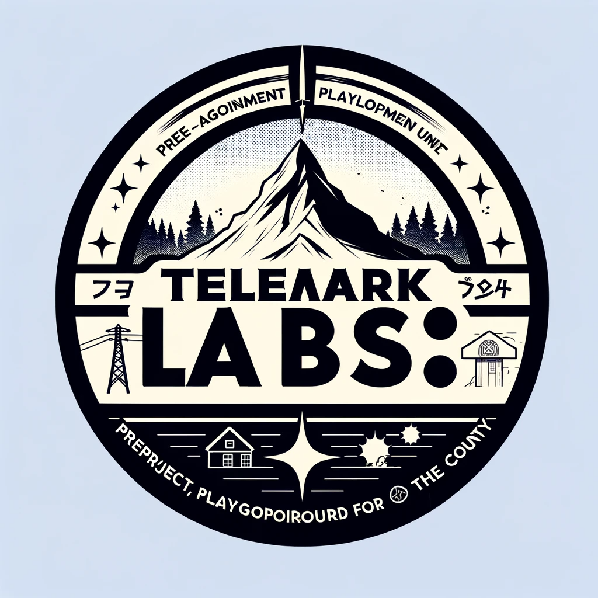

# Hvorfor labs? 

## Skape en ramme for å utforske nye løsninger
Gjennom en et formelt konsept kan vi skape en arena hvor gode idéer og vonde vondter kan samles. 

Det er fint å ha et sted å gå. *Funker ikke laptopen?* Ta en tur til servicedesken. *Lei av å klikke på de samme tingene 200 ganger hver dag?* Kanskje labs kan hjelpe.

## Hvorfor ikke bare TTU?
TTU dekker et bredt landskap, så håpet er at flere baller kan kastes inn og fanges opp. 

## Hvordan skal dere gjøre det a'? 
Når det jobbes med en PNUTT (POC, Ny idé, utviklingsverktøy, ting, tang) skal det skje i en definert *sprintperiode* som inneholder: 

* Klart definerte brukerhistorier og akseptansekrav knyttet til alle oppgaver
* Tilstrekkelig ressurser for å kunne oppnå akseptansekravene som er satt i brukerhistorier
* Gjøre det tilgjengelig for **brukerne** (eller presentere og dokumentere teknologiske nyvinninger)
* Gjøre det tilgjengelig for alle/innbyggerne ved å blogge om de sære tingene vi gjør i fylkeskommunen og hvor kult det hadde vært å jobbe der

## Men *hva* skal dere gjøre?
* Bygge inn språkmodeller i eksisterende løsninger og dokumenter
* Spare brukeren (inkl. oss selv) for repetetetetive oppgaver (aka "jobbe *smartere*")
* Skaffe mer data og jobbe sammen med analyse-gjengen
* Kanskje bruke KI mot kollektivtrafikk, finne mønster, bysykkel, buss, eksponere nye tjenester mot innbyggerne, lage bedre energimålingssystemer, utvikle løsninger for kantiner ("magefølelsen")
* Utforske ny og eksisterende teknologi

## Hva skal dere *ikke* gjøre?
* Dette er ikke en erstatning for innovasjonsløypa
	- Heller en utvidelse av den hvor passende prosjekter kan filtreres videre
* Bygge ferdige produkter
	- Selv om mange av de samme menneskene kanskje vil bygge produkt, så burde det løftes ut av labs-gryta og inn i et prosjekt? (Tenker litt på drift, QA, vedlikehold, dokumentasjon)
## *Hvem* skal gjøre det?
* Det er behov for alle mulige hoder!

