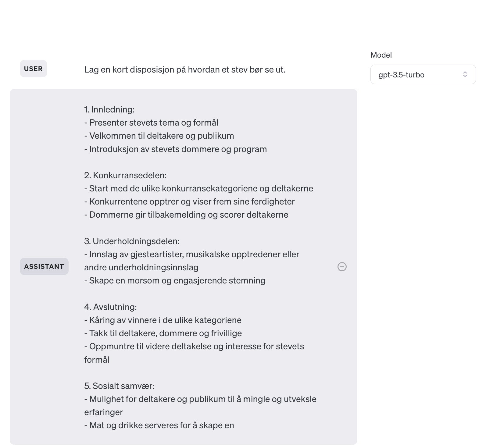
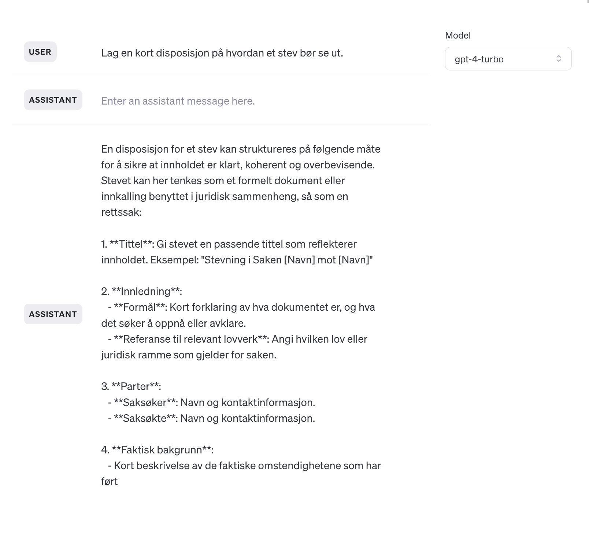
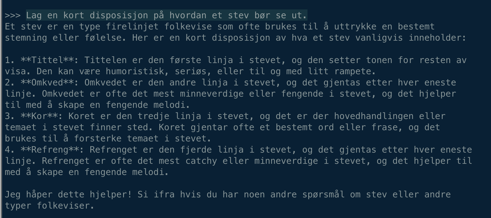
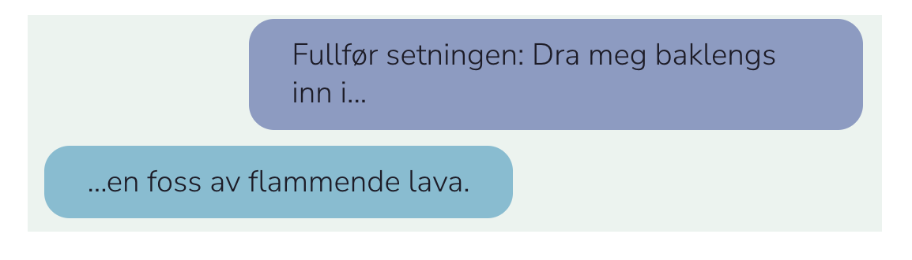
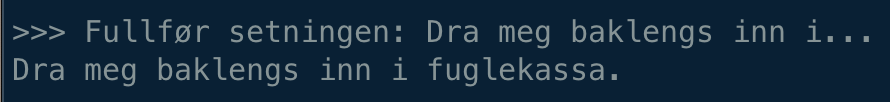

# Da Nora ble en språkmodell
En ganske vanlig fredag i april 2024 ble [NoraLLM](https://huggingface.co/norallm) lansert. En nyhet som kanskje gikk under radaren for mange, men på samme tid var dette en milepæl for norsk språkteknologi. NoraLLM er en språkmodell som er trent på en stor mengde norsk tekst. Den kan brukes til å generere tekst, svare på spørsmål og utføre en rekke andre språklige oppgaver. Frem til nå har de tilgjengelige språkmodellene hovedsaklig vært trent på engelskspråklig tekst. Dette har medført at tjenester som ChatGPT og tilsvarende tjenester fungerer dårligere på norsk enn på engelsk. En annet problem med språkmodeller er at de har en tendens til å forsterke skjevheter og fordommer som finnes i datasettene de er trent på. Dette gjelder alle språkmodeller. Det er derfor viktig at man er bevisst på hvilke egenskaper modellene har og hvilke data de er trent på før man benytter seg av denne teknologien.

**Bildene under viser hvordan tre ulike språkmodeller responderer på samme ledetekst. I alle tre eksemplene er ledeteksten: "Lag en kort disposisjon på hvordan et stev bør se ut."**

*Responsene er generert av henholdsvis GPT-3, GPT-4 og NoraLLM.  Disse eksemplene illustrerer hvordan ulikt trente modeller vil respondere forskjellig på samme ledetekst.*

## Hvorfor er dette viktig for oss?
Umiddelbart kan det virke som om en norsk språkmodell ikke har så stor betydning for oss i fylkeskommunen. På sikt kan det derimot prege hvordan vi løser oppgavene våre. En norsk språkmodell har mange bruksområder og kan være et nyttig verktøy for å automatisere manuelle oppgaver eller for å forbedre eksisterende tjenester. Eksempler på dette kan være å generere tekst til nettsider, svare på spørsmål fra innbyggere, kategorisere og søke i dokumenter eller skrive sammendrag. En språkmodell kan også brukes til å analysere tekst, for eksempel for å finne mønstre eller trender i store mengder tekst. En norsk modell vil følgelig kunne gjøre dette på en enda bedre måte enn en engelsk modell.

For å kunne realisere gode tjenester og lage magi er det derfor viktig at vi har tilgang til en god norsk språkmodell. Den vil være bedre egnet til å "forstå" og generere norsk tekst enn en engelsk språkmodell. Dette vil igjen føre til bedre resultater og en bedre brukeropplevelse for innbyggerne. I tillegg vil en norsk språkmodell være bedre egnet til å håndtere språklige trekk og kulturelle referanser som finnes i norsk tekst.

**Før slike tjenester kan realiseres må vi i felleskap teste, utforske, feile og lære. Vi må sammen reflektere rundt etiske, juridiske og sikkerhetsmessige konsekvenser av å ta i bruk denne teknologien. Dette er en prosess som tar tid og krever ressurser, men som det er viktig at gjøres skikkelig og i fellesskap. Men så... kan vi høste gevinster!**

## Etikk og opphavsrettigheter
En annen viktig problemstilling med de store internasjonale språkmodellene er at de er trent på store mengder data som er samlet inn fra det åpne internett eller andre kilder vi ikke vet så mye om. Selskapene er heller ikke åpne på hvilke informasjonskilder som inngår i treningsdataene. Dette betyr at de kan inneholde upassende eller støtende innhold, eller at de kan forsterke skjevheter og fordommer som finnes i datasettet. Dette er et stort problem med tanke på personvern og informasjonssikkerhet, og det er derfor viktig at vi har tilgang til en norsk språkmodell som er trent på en mer kontrollert og etisk forsvarlig måte. Heldigvis finnes det allerede mye data som er kvalitetssikret både språklig og med tanke på opphavsrettigheter. [Norwegian Colossal Corpus](https://ai.nb.no/datasets/) er et stort datasett på 45GB som er en samling av mange mindre norske datasett fra tidsskrifter, nasjonalbiblioteket, offentlig forvaltning m.m. Datasettet er sammenstillt og tilgjengeliggjort av [Nasjonalbiblioteket sin AI-lab](https://ai.nb.no/). Denne typen datasett vil bli viktig når man fremover skal trene bedre norske språkmodeller. Da har man i større grad kontroll på innhold, kilder, kvalitet og opphavsrettigheter.

## Dra meg baklengs inn i...
De aller fleste som har vokst opp i Norge vil ganske enkelt klare å fullføre denne setningen. For en språkmodell er ikke dette like åpenbart. Spesielt hvis treningsdataene ikke gjenspeiler dette.

**ChatGPT sin respons:**

**NoraLLM sin respons:**

## Hva kan vi bruke NoraLLM til?
I første omgang så må vi tenke på NoraLLM som en tidlig og litt umoden utgave av en norsk språkmodell. Den er ikke like avansert som de store språkmodellene som [ChatGPT](https://openai.com/chatgpt), [Claude](https://www.anthropic.com/claude) og [Gemini](https://deepmind.google/technologies/gemini/#introduction), men den har allikevel noen kvaliteter som gjør den interessant. Det å på sikt kunne tilby en norsk språkmodell der det er mye større åpenhet rundt treningsdataene og opphavsrettigheter er en stor fordel. Det er stor interesse for å bruke språkmodeller i undervisningen, og vi tror at NoraLLM kan være et skritt i riktig retning for bruk i skolen.

En annen fordel med NoraLLM er at den er såpass liten at den kan kjøres på en (nesten) vanlig datamaskin. Dette betyr at vi kan eksperimentere med språkmodellen uten å være avhengig av store ressurser eller eksterne tjenester. I tillegg så slipper vi å sende data ut av organisasjonen for å få tilgang til en språkmodell, noe som kan være avgjørende med tanke på personvern og informasjonssikkerhet.

Det er spennende tider, og KI er på alles lepper. Vi kan ikke og bør ikke bruke KI til alt, men det er uansett nyttig å reflektere litt over hvilke muligheter og ikke minst hvilke konsekvenser som kommer i kjølvannet av denne teknologien.

Hvis vi ikke gjør det så så risikerer vi å bli sittende med skjegget i _en bøtte med pasta_ ;-)

