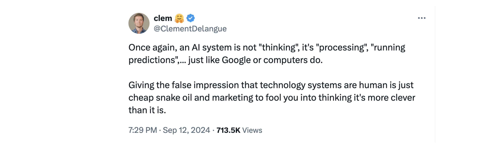
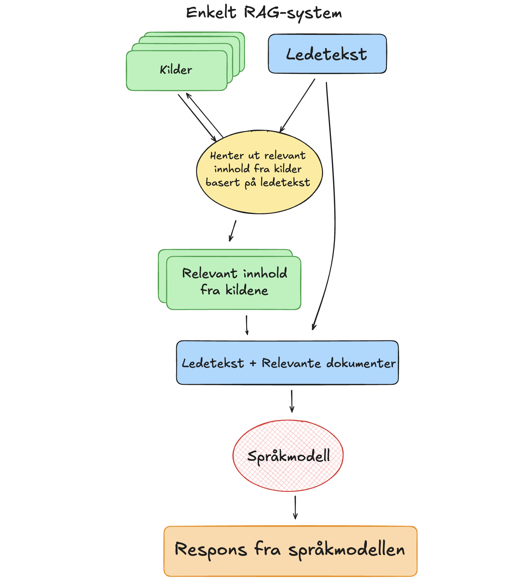

# Hvordan temme en språkmodell?
**Det å alltid ha tilgang til en allvitende og uendelig tålmodig assistent er en skikkelig luksus. Uten å gå lei produserer den de mest fantastiske svar og formuleringer kun ved hjelp en kort ledetekst som beskriver hva vi ønsker eller lurer på. Vi snakker selvfølgelig om språkmodeller, eller som det ofte omtales, kunstig inteligens. Teknologien, som ble allment tilgjengelig med ChatGPT høsten 2022, er uten tvil utrolig nyttig på mange måter, men som alle andre verktøy har den sine begrensninger. Det finnes bruksområder der bruken av KI i verste fall kan gi misvisende eller faktisk helt feil respons. Utfordringen er å vite når. Språkmodeller svarer feil med stor selvtillit og man kan lett bli forledet til å tro at responsen alltid er til å stole på. Kunnskap om hvordan språkmodeller fungerer og hvordan de kan settes i et system der vi utnytter styrkene til språkmodellene samtidig som reponsens har høy kvalitet og kan forklares er derfor helt avgjørende for at vi kan ta i bruk denne teknologien på en ansvarlig måte.**

På [SNL](https://snl.no/spr%C3%A5kmodell) kan vi lese: "_En språkmodell er en statistisk modell av et språk som brukes innen språkteknologi. Modellen gir en sannsynlighetsfordeling over sekvenser av ord og kan derfor brukes til å analysere og generere tekst basert på naturlige språk, slik som norsk. Språkmodeller er en viktig del av løsninger for chatbots, maskinoversettelse, talegjenkjenning, dialogsystemer og tekstklassifisering._" Responsen fra en språkomdell er altså basert på prosessering og egenskapene til dataene den er trent på. Det er derfor viktig å være klar over at språkmodeller ikke har en forståelse av verden slik vi mennesker har. De har heller ingen evne til å tenke eller resonnere. De er kun i stand til å generere tekst basert på dataene de er trent på.

Grunnleggeren av Huggingface, Clément Delangue, er tydelig på at man ikke må menneskeliggjøre eller tillegge teknologien egenskaper den ikke har.

Bilde: _Skjermbilde fra [innlegg på X](https://x.com/ClementDelangue/status/1834283206474191320) av Hugginface CEO Clément Delangue_

Med et realistisk syn på hva språkmodellenes styrker og svakheter kan vi på en mye bedre måte utnytte teknologien på en ansvarlig måte.

## Utnytte styrkene og unngå svakhetene
Det finnes mange ulike teknikker for å forbredre kvaliteten på responsene fra en KI-basert samtalerobot. Her er et forsøk på å beskrive prosessen og de teknikkene som brukes i Hugin for å utnytte styrkene og unngår svakhetene til en språkmodell.

Først og fremst er det viktig å velge riktig modell til oppgaven som skal løses. Problemet er at det i dag ikke finnes noen norske alternativer som er like gode som de store internasjonale språkmodellene. Når det er sagt, så er det er allikevel mye positivt som skjer bl.a. hos språkteknologiruppen på UiO og hos Nasjonalbiblioteket. Det er i tillegg er det grunn til å håpe at den splitter nye nasjonale digitaliseringsstrategien vil påvirke utviklingen rundt norsk språkteknologi og tilhørende infrastruktur på en positiv måte. Dette tar nok en stund, så vi må derfor ta utgangspunkt i dagens situasjon, og lage en rigg rundt språkmodellene som er tilgjengelige i dag slik at man kan øke kvalitet og reliabilitet så langt det er mulig.

Selv om vi ikke helt kan "temme" språkmodellene, så er det allikevel mulig å bruke kombinasjoner av flere teknikker for å øke kvaliteten på responsene. Dette gjøres bl.a. i de spesialiserte samtalerobottene for matematikk og helse og oppvekstfag.

[RAG (Retreival Augmented Generation)](https://research.ibm.com/blog/retrieval-augmented-generation-RAG) er en teknikk som kombinerer det beste fra to verdener. Formuleringsevnen til en språkmodell og innhold fra en kvalitetssikret kilde. Dette gjøres ved å knytte språkmodellen til en kilde vi selv har kontroll på for så å instruere systemet til å kun respondere med utgangspunkt i denne. Dette gir en vesentlig mer pålitelig og verifiserbar respons sammenliknet med å bruke en generisk chatbot som ChatGPT.

 
Bilde: _Modell av et RAG-system slik det brukes i Hugin._

Selv om RAG øker kvaliteten på responsene betraktelig så kan svaret fortsatt inneholde unøyakltigheter eller feil. Det er derfor viktig å ha en mekanisme for å å gi brukeren enkel tilgang til relevante kilder slik at man selv kan vurdere svaret fra samtalerobotten.

I Hugin sine spesialiserte samtalerobotter er det lagt til en funksjon som henter lenker til relevante kvalitetssikrede kilder. Dette gjøres ved returnere den første responsen fra språkmodellen sammen med en ny instruks om å hente ut tre relevante nøkkelord fra det opprinnelige svaret. Til forskjell fra den første spørringen benyttes nå en [funksjon for å få språkmodellen til å generere strukturerte data](https://openai.com/index/introducing-structured-outputs-in-the-api/) på et format som vi selv kan bestemme. Dette sikrer at dataene vi for ut fra språkmodellen er på et format som er egnet til å finne relevante lenker til verifiserte kilder.

# En slags oppsummering
Det er viktig å være klar over at språkmodeller ikke har en forståelse av verden slik vi mennesker har. De har heller ingen evne til å tenke, resonnere eller vite noe om fakta. De er kun i stand til å generere tekst basert på dataene de er trent på. Med et realistisk syn på hva språkmodellenes styrker og svakheter kan vi på en mye bedre måte utnytte teknologien på en ansvarlig måte. I Hugin bruker vi en kombinasjon av teknikker for å øke kvaliteten på responsene i bl.a. de spesialiserte samtalerobottene for matematikk og helse og oppvekstfag. I tillegg til tekniske løsninger er det også viktig at brukerne selv har en forståelse av en del nøkkelegenskaper til teknologien. Det er ikke slik at man må være mekaniker for å kjøre bil, ei heller en KI-ekspert for å bruke en samtalerobot, men det er viktig å ha en viss forståelse av hvordan teknologien fungerer for å kunne utnytte den på en god måte.