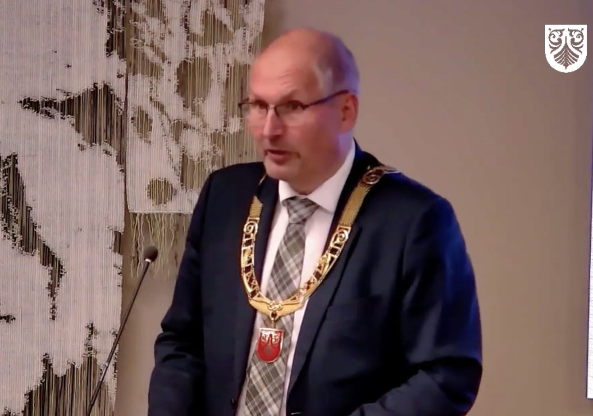
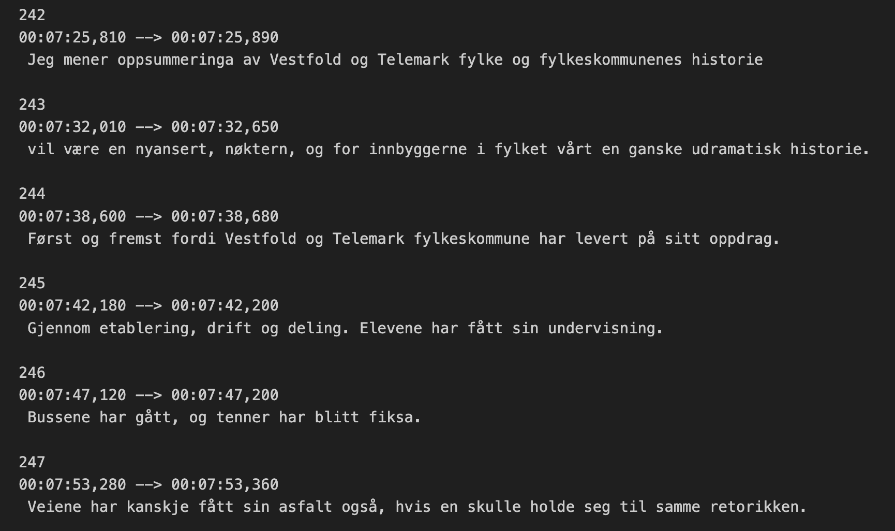
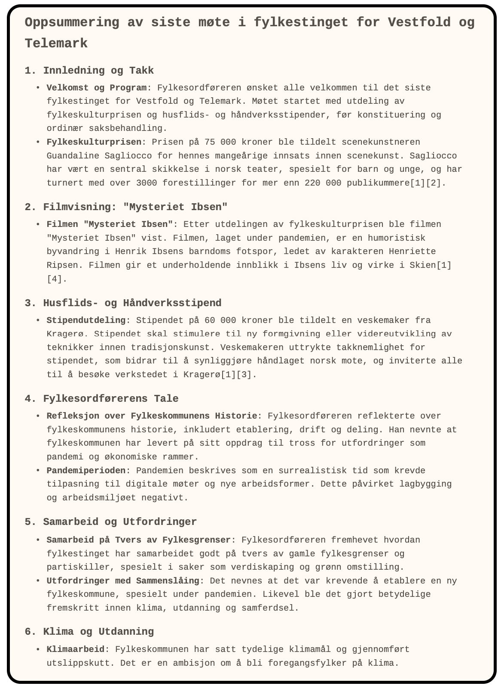

# Transkripsjon av fylkesting med hjelp fra Nasjonalbiblioteket

**Hvem skulle tro at et bibliotek, ja selveste Nasjonalbiblioteket, skulle bli en av landets mest innovative aktører innen språkteknologi! I tillegg [deler de villig vekk](https://www.nb.no/pressemeldinger/nasjonalbiblioteket-deler-kunstig-intelligens-som-skjoner-norske-dialekter-og-gjer-tale-om-til-tekst/) sine ressurser og kunnskap til felleskapets beste. Det er jo helt fantastisk! Bruksområdene er mange så la oss se på hva Nasjonalbiblioteket har gjort som gjør at dette er så aktuelt og spennende for oss i Telemark fylkeskommune.**

## Språkmodeller med norske treningsdata er mangelvare
Det siste året har det kommet en rekke [språkmodeller](https://snl.no/spr%C3%A5kmodell) som imponerer med sine evner til å generere tekst. Problemene er bare at de fleste av disse modellene er trent på engelskspråklig tekst, noe som gjør at de ikke er like gode til å generere norsk tekst. Dessverre er det veldig dyrt og ressurskrevene å trene opp en språkmodell fra bunnen av, og det er derfor ingen som har gjort dette for norsk språk. Sannsynligvis vil det heller ikke skje med første.

Heldigvis finnes det teknikker som gjør at man kan ta en eksisterende språkmodell og "finjustere" den på norsk tekst. Det er akkurat det som er gjort med [NoraLLM](https://huggingface.co/norallm). Den er basert på en den franske språkmodellen [Mistral](https://mistral.ai/), men er trent videre på norsk tekst. Dette gjør at den er bedre egnet til å generere norsk tekst enn de store internasjonale modellene.

## Andre typer KI-modeller
Det finnes mange typer KI-modeller, og språkmodeller er bare en av mange. For å transkribere tale til tekst brukes det en annen type modell som kalles en talegjenkjenner eller på engelsk [automatic speach recognition (ASR)](https://openai.com/index/whisper/). Denne typen modell er trent på store mengder taleopptak og kan derfor gjenkjenne tale og skrive den ned som tekst. Nasjonalbiblioteket har tatt [utgangspunkt](https://openai.com/index/whisper/) i en slik modell og trent den videre på store mengder norske data. Dette gjør at modellen er [mye bedre egnet til å transkribere norsk tale](https://www.tek.no/nyheter/nyhet/i/3ELqAq/ai-transkriberer-norsk-tale-nesten-like-godt-som-mennesker) enn de store internasjonale modellene.

Treningsdataene som er brukt stammer fra [Språkbanken](https://www.nb.no/sprakbanken/) og Nasjonalbiblioteket sin digitale samling, og inkluderer:

* [NST norsk ATG-database](https://www.nb.no/sprakbanken/ressurskatalog/oai-nb-no-sbr-13/)
* [Stortingskorpuset](Stortingskorpuset 2.0)
* [TV-programmer (NRK) med teksting](https://www.nb.no/en/the-collection/)
* [Lydbøker](https://www.nb.no/en/the-collection/)

Det er mange bruksområder for en slik modell i fylkeskommunen. En av de mest åpenbare er å transkribere møter og samtaler. Dette kan være nyttig for å lage referater eller for å gjøre møter tilgjengelig for de som ikke har mulighet til å delta.

_Bilde: Fylkesordfører Terje Riis Johansen taler på det siste fylkestinget i Vestfold og Telemark fylkeskommunes historie_

 En annen mulighet er å transkribere opptak av forelesninger eller undervisning. Dette kan være nyttig for å lage tekstbaserte notater eller for å gjøre undervisningen tilgjengelig for de som ikke har mulighet til å delta fysisk. Dette kan gjøres allerede i dag med mange av de kommersielle tjenestene, men disse er ofte basert på engelskspråklige modeller og fungerer derfor ikke like godt på norsk.

## Eksempel på transkripsjon av et fylkesting

For å vise hvor godt en slik modell kan fungere er det tatt utgangspunkt i et [opptak av det siste fylkestinget som ble avholdt i tidligere Vestfold og Telemark fylkeskommune](https://vimeo.com/showcase/10095638/video/890987112). Møtet har et ganske komplekst lydbilde med flere ulike stemmer, visning av film og tale med ganske markert dialekt.

_Bilde: Utdrag fra transkripsjon av fylkestingsmøte gjort med Nasjonalbiblioteket sin modell._

Når man har en transkripsjon av god kvalitet kan denne brukes som utgangspunkt for å lage referater, søke i opptak eller for å lage tekstbaserte notater. Dette kan være nyttig for å gjøre møter og forelesninger tilgjengelig for flere, på ulike språk, forenklet språk, eller for å lage referater som kan deles med de som ikke har mulighet til å delta.

For å lage gode sammenstillinger av transkripsjoner kan en man benytte en annen type KI-modell som vi kjenner som  språkmodeller. Utsnitter under er en automatisk generert sammenstilling av transkripsjonen fra fylkestinget.

_Bilde: Eksempel oppsummering laget av en språkmodell_

## Mulighetene er mange
Som fylkeskommune har vi et særlig ansvar for å benytte oss av ny teknologi for å gjøre tjenestene våre bedre og mer tilgjengelige. I tillegg bør vi tilstrebe oss å bruke teknologi som er laget på en etisk forsvarlig måte og som bygger opp under felleskapets verdier. Dette kan gjøres ved å velge KI-modeller som er trent på norske data og som er laget av aktører som deler sine ressurser og kunnskap med felleskapet uten å bryte med personvern og opphavsrettigheter. I tillegg er vi med på å støtte opp om norsk språkteknologi og bidra til at vi får bedre tjenester og produkter på norsk. Ved å bruke mindre, men spesialiserte modeller, kan vi også bidra til en mer bærekraftig utvikling av KI-teknologi som bruker mindre energi og ressurser ved å lage tjenester som kjører lokalt.

